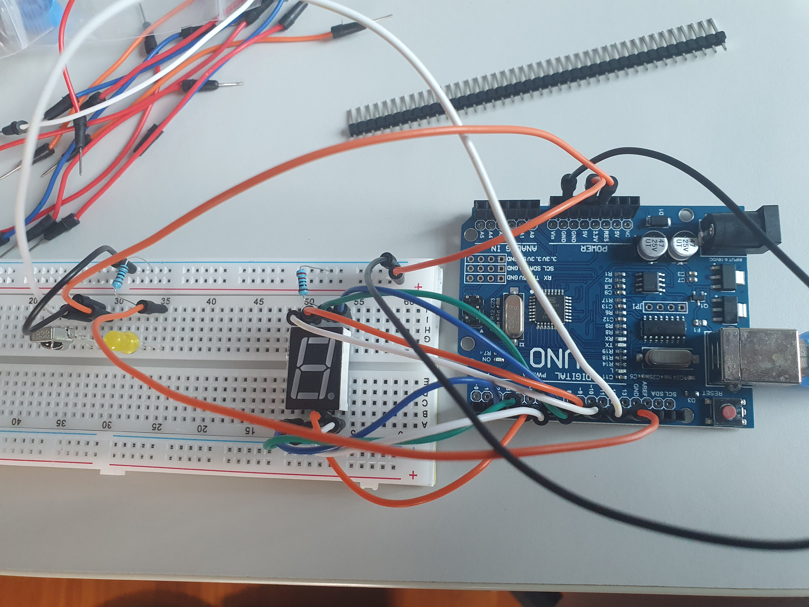
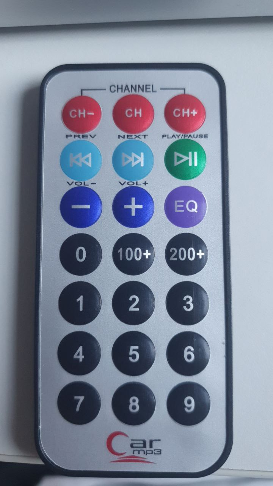

# Infrared Remote Number Display

This simple project takes in input from an infrared remote control, and displays the number that is pressed.

## Project Image



## Project Video

<video width="320" height="240" controls>
  <source src="media/demo_video.mp4" type="video/mp4">
</video>

## Materials used

- Arduino UNO
- 5161AS 7-segment display
- 1838 Infrared Receiver + Remote Control
- 1\*1K, 1\*220 ohm Resistors
- Breadboard and wires

# Project Approach

First, I set up the infrared sensor according to this [tutorial](https://qxf2.com/blog/arduino-tutorials-for-testers-decoding-of-ir-receiver/), which decodes the infrared signals transmitted fro the remote control to the sensor.

Next, I mapped the decoded codes to each button on the remote control, by testing all the buttons with the `IR_Remote_Simple` script. I then recorded the decoding table under the `Car_Remote_Decoder.csv` file (as seen in the table below).

Table of button-to-code conversion:

| Button     | HexCode  |
| ---------- | -------- |
| CH-        | BA45FF00 |
| CH         | B946FF00 |
| CH+        | B847FF00 |
| PREV       | BB44FF00 |
| NEXT       | BF40FF00 |
| PLAY/PAUSE | BC43FF00 |
| VOL-       | F807FF00 |
| VOL+       | EA15FF00 |
| EQ         | F609FF00 |
| 0          | E916FF00 |
| 100+       | E619FF00 |
| 200+       | F20DFF00 |
| 1          | F30CFF00 |
| 2          | E718FF00 |
| 3          | A15EFF00 |
| 4          | F708FF00 |
| 5          | E31CFF00 |
| 6          | A55AFF00 |
| 7          | BD42FF00 |
| 8          | AD52FF00 |
| 9          | B54AFF00 |

Remote control used:


With the encoding step done, now I just have to convert the codes that represent the buttons 0 to 9 on the remote control to a 7-segment display.

Firstly, I connected pins 2-9 of the Arduino to the 8 segments (7 on the digit + 1 decimal point) to the digital display according to this arrangement:

| Pin | Segment |
| --- | ------- |
| 2   | E       |
| 3   | D       |
| 4   | C       |
| 5   | DP      |
| 6   | B       |
| 7   | A       |
| 8   | F       |
| 9   | G       |

While I could use a library to help me encode a digit to a series of digital highs and lows that the display cound understand, I decided to have some fun and implement my own method of encoding instead.

Sine there are a total of 8 digital value inputs to the display, I decided to represent the state of each of the 8 pins as an 8-digit long binary number ('sequence code'), which fits well with arduino's `int` data type.

Here is a table of encoding:

```arduino
const long int ZERO = 0xE916FF00; const int ZERO_SEQ = 0xEE;
const long int ONE = 0xF30CFF00; const int ONE_SEQ = 0x28;
const long int TWO = 0xE718FF00; const int TWO_SEQ = 0xCD;
const long int THREE = 0xA15EFF00; const int THREE_SEQ = 0x6D;
const long int FOUR = 0xF708FF00; const int FOUR_SEQ = 0x2B;
const long int FIVE = 0xE31CFF00; const int FIVE_SEQ = 0x67;
const long int SIX = 0xA55AFF00; const int SIX_SEQ = 0xE7;
const long int SEVEN = 0xBD42FF00; const int SEVEN_SEQ = 0x2C;
const long int EIGHT = 0xAD52FF00; const int EIGHT_SEQ = 0xEF;
const long int NINE = 0xB54AFF00; const int NINE_SEQ = 0x6F;
```

For example, the number 1 involves segments B and C to be set to `HIGH`. This is represented by the binary value `00101000`, since segment B is connected to pin 6 and segment C to pin 4. With this, I set `ONE_SEQ` to the equivalent hex value of `0x28`.

Finally, by mapping the input code from the IR sensor to its corresponding sequence code, and running over the code shown below, I am abe to set the digit onto the digital display!

```arduino
    digitalWrite(E, seq & 0x80 ? HIGH:LOW); // pin 2
    digitalWrite(D, seq & 0x40 ? HIGH:LOW); // pin 3
    digitalWrite(C, seq & 0x20 ? HIGH:LOW); // pin 4
    digitalWrite(DP, seq & 0x10 ? HIGH:LOW); // pin 5
    digitalWrite(B, seq & 0x08 ? HIGH:LOW); // pin 6
    digitalWrite(A, seq & 0x04 ? HIGH:LOW); // pin 7
    digitalWrite(F, seq & 0x02 ? HIGH:LOW); // pin 8
    digitalWrite(G, seq & 0x01 ? HIGH:LOW); // pin 9
```
